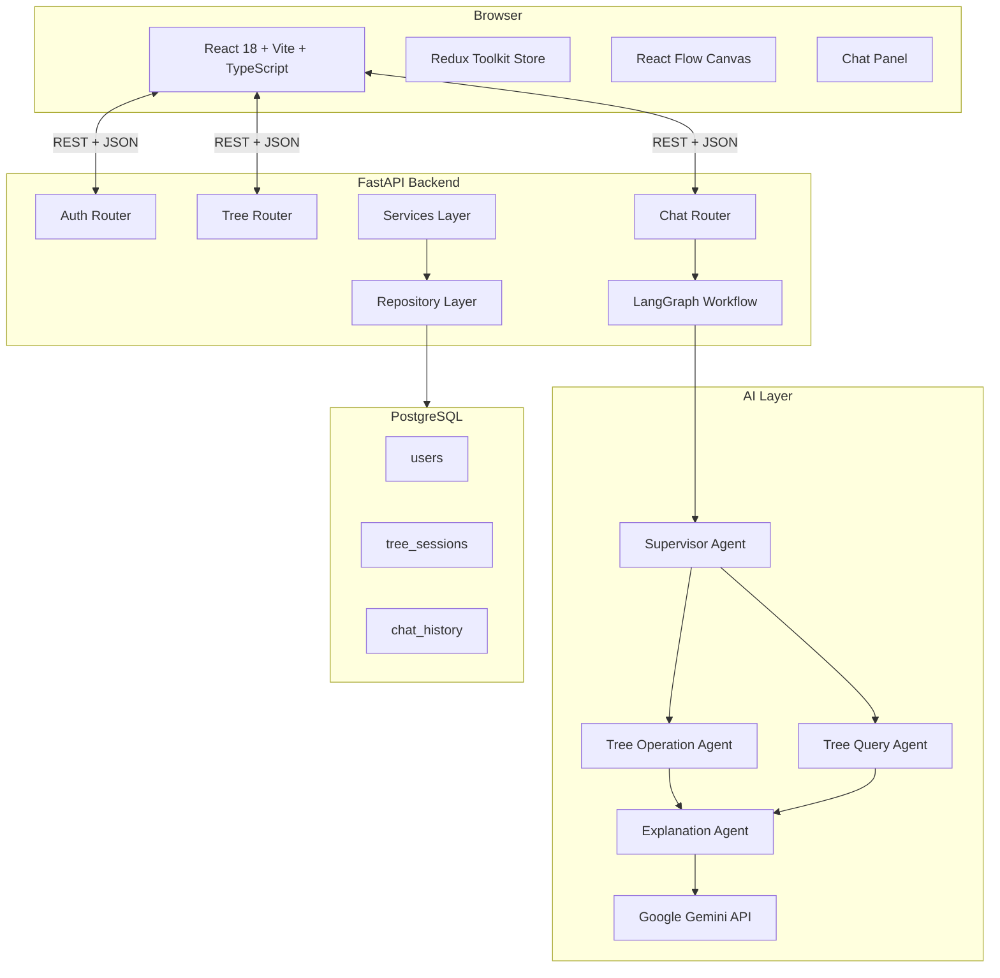
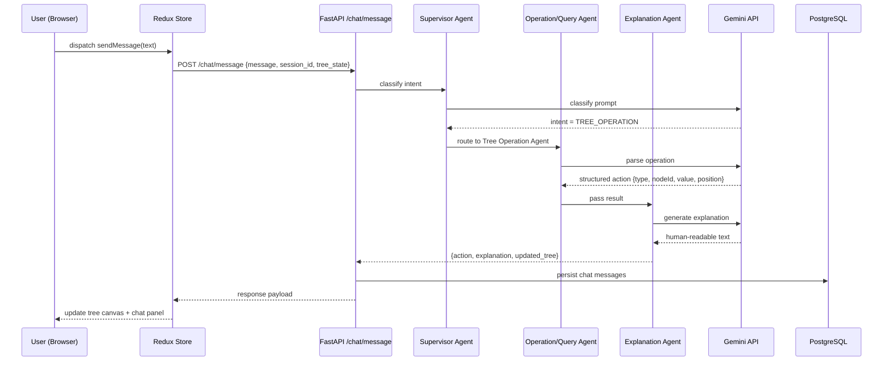
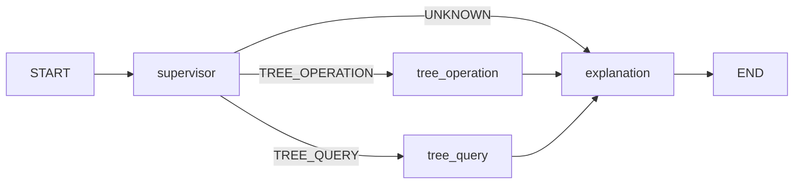

# Design Document: TreeView AI

## Overview

Agentic-Tree is a full-stack AI-powered web application for creating, visualizing, and analyzing Binary Tree data structures. Users interact through a three-panel dark-themed workspace: a sidebar for manual controls, a React Flow canvas for real-time visualization, and an AI chat panel backed by a LangGraph multi-agent system. The backend is a FastAPI service with PostgreSQL persistence, JWT authentication, and a LangGraph workflow powered by Google Gemini.

---

## Architecture

### High-Level Architecture



### Request Flow: AI Chat Message



---

## Components and Interfaces

### Frontend Component Tree

```
App
├── Router
│   ├── AuthPage (Login / Register)
│   └── ProtectedRoute
│       ├── DashboardPage (session list)
│       └── WorkspacePage
│           ├── Navbar
│           ├── LeftSidebar
│           │   ├── TreeOperationsPanel
│           │   │   ├── AddNodeButton
│           │   │   ├── DeleteNodeButton
│           │   │   ├── EditNodeButton
│           │   │   ├── SearchNodeButton
│           │   │   └── ConnectNodesButton
│           │   └── TraversalPanel
│           │       ├── PreorderButton
│           │       ├── InorderButton
│           │       └── PostorderButton
│           │   └── ResetTreeButton (pinned bottom)
│           ├── TreeCanvas
│           │   ├── ReactFlow
│           │   │   ├── CustomTreeNode
│           │   │   └── CustomEdge
│           │   ├── EmptyState
│           │   └── TraversalSequenceDisplay
│           └── ChatPanel
│               ├── ChatHeader
│               ├── MessageList
│               │   └── MessageBubble
│               ├── TypingIndicator
│               └── ChatInputFooter
```

### Redux Store Shape

```typescript
interface RootState {
  auth: AuthState;
  tree: TreeState;
  chat: ChatState;
}

interface AuthState {
  user: User | null;
  token: string | null;
  isLoading: boolean;
  error: string | null;
}

interface TreeNode {
  id: string;
  value: number;
  left: string | null;   // child node id
  right: string | null;  // child node id
  parentId: string | null;
}

interface TreeState {
  nodes: Record<string, TreeNode>;
  rootId: string | null;
  sessionId: string | null;
  sessionName: string;
  isLoading: boolean;
  traversalSequence: string[];
  highlightedNodeId: string | null;
  error: string | null;
}

interface ChatMessage {
  id: string;
  role: 'user' | 'assistant';
  content: string;
  timestamp: string;
}

interface ChatState {
  messages: ChatMessage[];
  isTyping: boolean;
  error: string | null;
}
```

### React Flow Node/Edge Types

- **CustomTreeNode**: Renders a circular node with the numeric value. Supports highlight states: `default`, `highlighted` (blue glow during traversal), `found` (green for search result).
- **CustomEdge**: Renders a straight or bezier edge between parent and child nodes with a subtle color matching the theme.

### Layout Algorithm

Tree nodes are positioned using a recursive top-down layout algorithm:
- Root is placed at `(canvasWidth / 2, 80)`
- Each level adds `100px` vertical spacing
- Horizontal spacing is calculated as `horizontalGap / 2^level` to prevent overlap
- Layout is recalculated on every tree state change and passed to React Flow as `nodes` array with `position: {x, y}`

---

## Backend Architecture

### Folder Structure

```
backend/
├── app/
│   ├── main.py                  # FastAPI app entry point
│   ├── config.py                # Environment config (pydantic-settings)
│   ├── database.py              # SQLAlchemy engine + session
│   ├── dependencies.py          # Shared FastAPI dependencies (get_db, get_current_user)
│   ├── models/
│   │   ├── user.py
│   │   ├── tree_session.py
│   │   └── chat_history.py
│   ├── schemas/
│   │   ├── auth.py
│   │   ├── tree.py
│   │   └── chat.py
│   ├── routers/
│   │   ├── auth.py
│   │   ├── tree.py
│   │   └── chat.py
│   ├── services/
│   │   ├── auth_service.py
│   │   ├── tree_service.py
│   │   └── chat_service.py
│   ├── repositories/
│   │   ├── user_repository.py
│   │   ├── tree_repository.py
│   │   └── chat_repository.py
│   └── agents/
│       ├── graph.py             # LangGraph workflow definition
│       ├── supervisor.py        # Supervisor Agent
│       ├── tree_operation.py    # Tree Operation Agent
│       ├── tree_query.py        # Tree Query Agent
│       └── explanation.py       # Explanation Agent
├── alembic/
│   └── versions/
├── tests/
│   ├── unit/
│   └── api/
├── alembic.ini
├── requirements.txt
└── Dockerfile
```

### Frontend Folder Structure

```
frontend/
├── src/
│   ├── main.tsx
│   ├── App.tsx
│   ├── store/
│   │   ├── index.ts
│   │   ├── authSlice.ts
│   │   ├── treeSlice.ts
│   │   └── chatSlice.ts
│   ├── pages/
│   │   ├── AuthPage.tsx
│   │   ├── DashboardPage.tsx
│   │   └── WorkspacePage.tsx
│   ├── components/
│   │   ├── Navbar/
│   │   ├── LeftSidebar/
│   │   ├── TreeCanvas/
│   │   └── ChatPanel/
│   ├── hooks/
│   │   ├── useAuth.ts
│   │   ├── useTree.ts
│   │   └── useChat.ts
│   ├── api/
│   │   ├── axiosClient.ts
│   │   ├── authApi.ts
│   │   ├── treeApi.ts
│   │   └── chatApi.ts
│   ├── utils/
│   │   ├── treeLayout.ts
│   │   └── traversal.ts
│   ├── types/
│   │   └── index.ts
│   └── styles/
│       ├── theme.ts
│       └── global.css
├── index.html
├── vite.config.ts
├── tsconfig.json
├── package.json
└── Dockerfile
```

---

## Data Models

### PostgreSQL Schema

```sql
-- users
CREATE TABLE users (
    id UUID PRIMARY KEY DEFAULT gen_random_uuid(),
    name VARCHAR(100) NOT NULL,
    email VARCHAR(255) UNIQUE NOT NULL,
    password_hash VARCHAR(255) NOT NULL,
    created_at TIMESTAMP WITH TIME ZONE DEFAULT NOW(),
    updated_at TIMESTAMP WITH TIME ZONE DEFAULT NOW()
);

-- tree_sessions
CREATE TABLE tree_sessions (
    id UUID PRIMARY KEY DEFAULT gen_random_uuid(),
    user_id UUID NOT NULL REFERENCES users(id) ON DELETE CASCADE,
    name VARCHAR(255) NOT NULL DEFAULT 'Untitled Session',
    tree_json JSONB NOT NULL DEFAULT '{}',
    created_at TIMESTAMP WITH TIME ZONE DEFAULT NOW(),
    updated_at TIMESTAMP WITH TIME ZONE DEFAULT NOW()
);

-- chat_history
CREATE TABLE chat_history (
    id UUID PRIMARY KEY DEFAULT gen_random_uuid(),
    user_id UUID NOT NULL REFERENCES users(id) ON DELETE CASCADE,
    session_id UUID NOT NULL REFERENCES tree_sessions(id) ON DELETE CASCADE,
    role VARCHAR(20) NOT NULL CHECK (role IN ('user', 'assistant')),
    message TEXT NOT NULL,
    timestamp TIMESTAMP WITH TIME ZONE DEFAULT NOW()
);
```

### Tree JSON Format (stored in tree_sessions.tree_json)

```json
{
  "rootId": "node-1",
  "nodes": {
    "node-1": { "id": "node-1", "value": 10, "left": "node-2", "right": "node-3", "parentId": null },
    "node-2": { "id": "node-2", "value": 5,  "left": null,     "right": null,     "parentId": "node-1" },
    "node-3": { "id": "node-3", "value": 15, "left": null,     "right": null,     "parentId": "node-1" }
  }
}
```

---

## LangGraph Multi-Agent Design

### Agent State

```python
class AgentState(TypedDict):
    messages: list[BaseMessage]
    intent: str                  # TREE_OPERATION | TREE_QUERY | SESSION_MANAGEMENT | UNKNOWN
    tree_state: dict             # current tree JSON from frontend
    action: dict | None          # structured action from operation/query agent
    explanation: str             # final human-readable response
    error: str | None
```

### Graph Flow



### Supervisor Agent Prompt Strategy

The Supervisor uses a structured Gemini prompt to classify intent:
- Receives: user message text
- Returns: one of `TREE_OPERATION`, `TREE_QUERY`, `SESSION_MANAGEMENT`, `UNKNOWN`
- Uses few-shot examples in the system prompt for reliable classification

### Tree Operation Agent

Parses natural language into a structured action:
```python
{
  "type": "INSERT" | "DELETE" | "EDIT" | "RESET",
  "nodeValue": int | None,
  "parentId": str | None,
  "position": "left" | "right" | None,
  "targetNodeValue": int | None
}
```

### Tree Query Agent

Computes answers from the tree_state dict:
- Height, depth, leaf nodes, node count, traversals, parent/child relationships
- Does NOT call Gemini for computation — uses pure Python tree algorithms
- Passes structured result to Explanation Agent

### Explanation Agent

Receives the structured action/result and generates a natural language response via Gemini. Always produces a friendly, educational tone.

---

## API Design

### Auth Endpoints

| Method | Path | Auth | Description |
|--------|------|------|-------------|
| POST | /auth/register | No | Register new user |
| POST | /auth/login | No | Login, returns JWT |
| GET | /auth/profile | Yes | Get current user info |

### Tree Endpoints

| Method | Path | Auth | Description |
|--------|------|------|-------------|
| POST | /tree/session | Yes | Create new session |
| GET | /tree/session/{id} | Yes | Get session + tree |
| PUT | /tree/session/{id} | Yes | Update tree state |
| DELETE | /tree/session/{id} | Yes | Delete session |
| GET | /tree/sessions | Yes | List user's sessions |

### Chat Endpoints

| Method | Path | Auth | Description |
|--------|------|------|-------------|
| POST | /chat/message | Yes | Send message, get AI response |
| GET | /chat/history/{sessionId} | Yes | Get chat history |
| DELETE | /chat/history/{sessionId} | Yes | Clear chat history |

### Request/Response Examples

**POST /chat/message**
```json
// Request
{
  "session_id": "uuid",
  "message": "Insert node 8 as left child of node 4",
  "tree_state": { "rootId": "node-1", "nodes": { ... } }
}

// Response
{
  "explanation": "Done! I've inserted node 8 as the left child of node 4.",
  "action": {
    "type": "INSERT",
    "nodeValue": 8,
    "parentId": "node-1",
    "position": "left"
  },
  "updated_tree": { "rootId": "node-1", "nodes": { ... } }
}
```

---

## Error Handling

### Frontend
- Axios interceptor catches 401 responses and dispatches logout action
- All async thunks use `createAsyncThunk` with `rejectWithValue` for error propagation
- Error messages displayed in toast notifications (Bootstrap alerts)
- Tree operation errors shown inline in the sidebar form

### Backend
- FastAPI exception handlers for `HTTPException`, `ValidationError`, and unhandled exceptions
- All service methods raise typed `HTTPException` with appropriate status codes
- LangGraph errors are caught at the graph execution level and returned as structured error responses
- Database errors are caught in the repository layer and re-raised as service exceptions

### LangGraph Error Handling
- If Gemini API is unavailable, the graph returns a fallback error explanation
- If intent classification fails, routes to Explanation Agent with an "I didn't understand" response
- Malformed tree operations return a structured error without modifying tree state

---

## Testing Strategy

### Backend Unit Tests (Pytest)
- `tests/unit/test_tree_algorithms.py` — height, traversal, leaf node computation
- `tests/unit/test_auth_service.py` — password hashing, JWT creation/validation
- `tests/unit/test_agent_parsing.py` — Tree Operation Agent action parsing

### Backend API Tests (Pytest + httpx)
- `tests/api/test_auth.py` — register, login, protected route access
- `tests/api/test_tree.py` — session CRUD with authenticated requests
- `tests/api/test_chat.py` — message endpoint with mocked LangGraph

### Frontend Component Tests (Vitest + React Testing Library)
- `LoginForm.test.tsx` — form validation, submit behavior
- `TreeCanvas.test.tsx` — empty state rendering, node rendering
- `ChatPanel.test.tsx` — message display, input behavior

### End-to-End Tests (Playwright)
- `e2e/auth.spec.ts` — register and login flow
- `e2e/tree_workflow.spec.ts` — create session, add nodes via chat, verify canvas

---

## Docker & Deployment

### Services

```yaml
services:
  postgres:
    image: postgres:15
    volumes: [postgres_data:/var/lib/postgresql/data]
    environment: [POSTGRES_DB, POSTGRES_USER, POSTGRES_PASSWORD]

  backend:
    build: ./backend
    depends_on: [postgres]
    environment: [DATABASE_URL, SECRET_KEY, GEMINI_API_KEY, CORS_ORIGINS]
    ports: ["8000:8000"]

  frontend:
    build: ./frontend
    depends_on: [backend]
    ports: ["80:80"]
    environment: [VITE_API_BASE_URL]
```

### Frontend Dockerfile Strategy
- Stage 1: Node 20 Alpine — `npm ci && npm run build`
- Stage 2: Nginx Alpine — serve `/dist` on port 80 with SPA fallback config

### Backend Dockerfile Strategy
- Python 3.11 slim base
- Install dependencies via `pip install -r requirements.txt`
- Run with `uvicorn app.main:app --host 0.0.0.0 --port 8000`
- Run Alembic migrations on startup via entrypoint script

### AWS EC2 Deployment Steps
1. Launch Ubuntu 22.04 EC2 instance (t3.small minimum)
2. Install Docker and Docker Compose
3. Clone repository
4. Create `.env` file with production secrets
5. Run `docker-compose up -d --build`
6. Configure security group to allow ports 80 and 443

---

## Design Decisions & Rationale

| Decision | Rationale |
|----------|-----------|
| Generic Binary Tree (not BST) | Matches requirements — user controls placement explicitly |
| Redux as single source of truth | All UI and AI actions flow through Redux before hitting the API |
| Tree state sent with every chat message | Allows agents to reason about current tree without extra DB reads |
| Pure Python for tree queries | Avoids unnecessary LLM calls for deterministic computations |
| JSONB for tree storage | Flexible schema, efficient querying, no need for a graph DB |
| React Flow for visualization | Purpose-built for node graphs, handles layout, zoom, pan natively |
| LangGraph for agent orchestration | Provides stateful, inspectable multi-agent workflows with clear routing |
| Alembic for migrations | Industry standard for SQLAlchemy, supports rollback and versioning |
| Multi-stage Docker builds | Minimizes production image size, separates build and runtime concerns |
